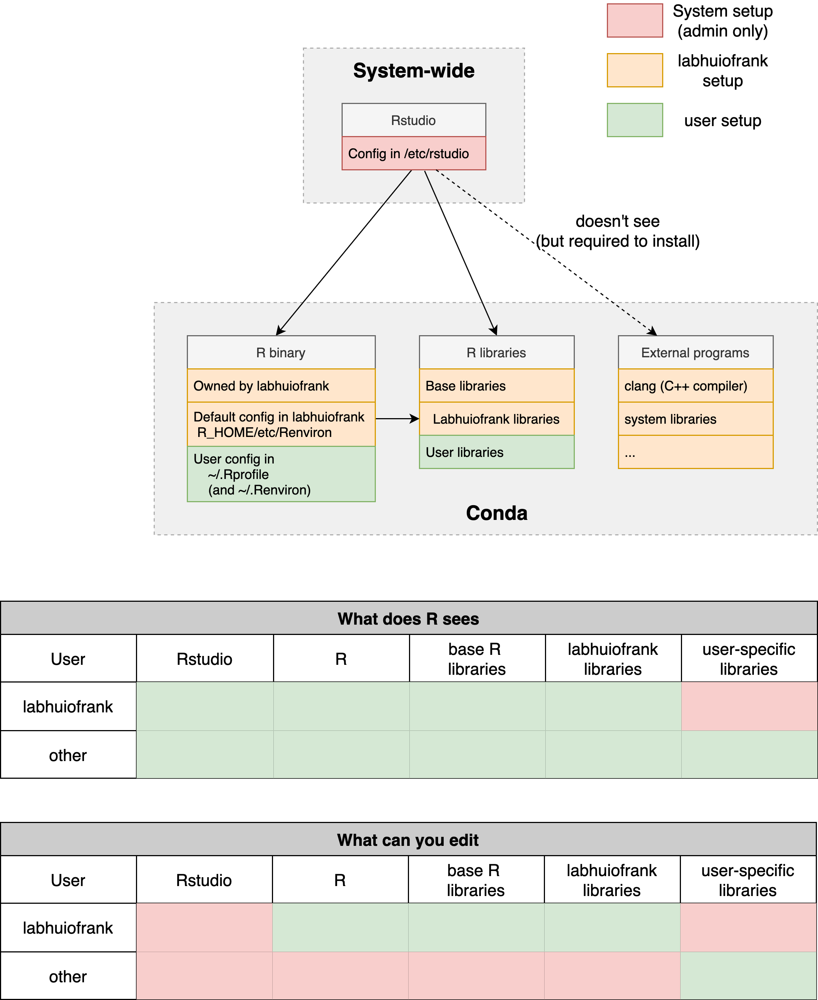

```{r setup, include=FALSE}
knitr::opts_chunk$set(echo = FALSE)
```

## About our lab computer

- Not a typical server ("normal" macOS)
- Enhanced desktop

```
> system_profiler SPHardwareDataType
    Hardware Overview:

      Model Name: iMac
      Model Identifier: iMac20,1
      Processor Name: 8-Core Intel Core i7
      Processor Speed: 3.8 GHz
      Number of Processors: 1
      Total Number of Cores: 8
      L2 Cache (per Core): 256 KB
      L3 Cache: 16 MB
      Hyper-Threading Technology: Enabled
      Memory: 128 GB
```

# Part 1: Managing rstudio-server

## Generalities

- Many things here are for your understanding, you don't need to memorize much. I feel like it is important to understand what you are working with to demystify it.
- The rstudio-server is a "service" (special type of background program) that:
  - Starts automatically when the computer starts and stops when it is turned off
  - Serves Rstudio on port 8787 \
  Note: port="door" to use when we arrive at address graphics2.kewalo.hawaii.edu) \
  Default door on web browser: 80
- Never delete the `rstudio` user. It is needed to run rstudio-server
  
- Testing it locally: on the lab iMAC, go to localhost:8787. If you can log in, the server works.
- To restart the server without turning it off:

```bash
sudo rstudio-server restart
# or
sudo rstudio-server stop
sudo rstudio-server start
```

## Before we start

### Challenges

- We want users to be able to use and install libraries
- We don't avoid installing the same library multiple times
- We don't avoid users affecting each other too much

### Setup
For each of these components, should defined at the user level? system level? somewhere in between?

- Rstudio
- R program
- R libraries

### Notes: 

- "system" level vs "lab admin" level
- why conda

## R setup

- R not installed system-wide, just available in a conda environment: \
`/Users/labhuiofrank/.miniconda3/envs/rserver`
- Environment specifications in yaml file at: \
`/Users/labhuiofrank/Public/conda-environments/rserver.yml`
- This is our main folder for storing libraries that are useful for most people in the lab (e.g. `ggplot2`). We want to keep it lean. 

## R Libraries setup

The main library folder belongs to the labhuiofrank user: other users cannot modify it (if they try, they can have a "Permission Denied" error)

```bash
$ whoami
labhuiofrank # OK!
$ conda activate rserver
$ conda install ...

# otherwise
EnvironmentNotWritableError: The current user does not have 
write permissions to the target environment.
  environment location: /Users/labhuiofrank/.miniconda3/envs/rserver
  uid: 512
  gid: 20
```

OR (if possible, avoid and use conda)

```R
> install.packages()
> devtools::install_github()
> biocManager::install()
```

***

### When to use the labhuiofrank account

- If you want to add more base packages and make it available to everyone.
- Usually to avoid, as modifying those packages can affect other users.

- Log in with the labhuiofrank account for that. Don't use your own and force you way through with `sudo`, it might get things messy (where different libraries belong to different users). 


### The issue

R is configured to look in the labhuiofrank account, and it's a problem because:

- We can't install libraries there
- But we still need R to check that because we want to use the default libraries

What to do then? Just tell R to look and install packages in multiple places

*** 

### Where does R find installed libraries?

- Next to where R is installed. In our case:
```R
> R.home()
/Users/labhuiofrank/.miniconda3/envs/rserver/lib/R
# Libraries are in R_HOME/library
```
- Order matters: if a library is installed in multiple location, R will get the first one that it finds.

Note:

- Wherever we are telling R to look. All folders need to be compatible: you cannot have libraries compiled with R-4.1 in one and others with R-4.2 in others.


## Installing new R libraries

- We want a modular system: each user will add to the base environment but not affect other users.
- I set up R in the labhuiofrank account to add automatically the following location:
`~/Library/R/x86_64/4.1/library` (no need to remember it)

```R
> .libPaths()
[1] "/Users/cedric/Library/R/x86_64/4.1/library"                
[2] "/Users/labhuiofrank/.miniconda3/envs/rserver/lib/R/library"
```

```bash
less /Users/labhuiofrank/.miniconda3/envs/rserver/lib/R/etc/Renviron
```

***

Great! For each user, this is automatically working (no need to do anything):

- If he tries to install a package, R will try first in his home directory, which he is allowed to access
- If he loads a library, R will first look at his personal library (good if you want to override base packages), then labhuiofrank's, the R base
- All libraries are isolated, no risk of breaking other users setup (as long as sudo is not used).

But...

- R needs external tools to install libraries. Besides, R is installed in the labhuiofrank's conda environment, not ours. 
- 2 options:
  - In Rstudio, the R from labhuiofrank is already loaded, we could use this one
  - In the terminal, we could activate labhuiofrank's environment and use it

- For now, it doesn't work from RStudio: RStudio is not well integrated with conda and cannot find all the programs necessary to install libraries. 
- But that's okay, we have the other option.

***

### Install a new library (most important part)

1. Log on your account on the iMAC with your account
2. Open a terminal and activate the labhuiofrank R environment:
```bash
$ conda activate /Users/labhuiofrank/.miniconda3/envs/rserver`
```
3. Open R and do your thing

```R
$ R
# opens R interactive interface
> install.packages() # or something else
```
***


## Bonus: Rstudio-server configuration

Although you'll probably never edit them, let's look at the configuration files:

```bash
cat /etc/rstudio/rserver.conf
cat /etc/rstudio/rsession.conf
cat /etc/rstudio/database.conf
```

# Part 2: Managing users and files

## Create a new user

- Through the GUI (recommended): https://support.apple.com/guide/mac-help/set-up-other-users-on-your-mac-mtusr001/mac
- Through the command-line (replace `USERNAME` and `PASSWORD` with their respective values).

```bash
# Create user (admin)
sudo sysadminctl -addUser USERNAME -home /Users/USERNAME -admin -shell /bin/bash
# Set password
sudo dscl . -passwd /Users/USERNAME PASSWORD
# Create home directory
sudo createhomedir -c
```

Test: `su - USERNAME` (su=switch user)

## Delete an existing user

- Through the GUI (recommended): https://support.apple.com/guide/mac-help/delete-a-user-or-group-mchlp1557/12.0/mac/12.0
- Through the command-line (replace `USERNAME` with its value). You will need to run each command with `sudo` to get admin privileges: 

```bash
# delete account
sudo sysadminctl -deleteUser USERNAME
# delete home directory (careful, it is not reversible)
sudo rm -rf /Users/USERNAME

# reboot computer
reboot
```

## Managing files

- On the command-line (via `scp` or `rsync`, see linux tutorial)
- SFTP access: 
  - Install with `brew install --cask cyberduck`
  - Open Cyberduck
  - File > Open connection

***
### Cyberduck connection

Protocol: SFTP (SSH File Transfer Protocol) \
Server: graphics2.kewalo.hawaii.edu \
Username: <Your username> \
Either:

  - Password: <Password>
  - SSH Private Key: <Path to private RSA key> (default: ~/.ssh/id_rsa)

***
### Shared folder

- Mac computers have by default a folder called "Public" that any user can access
- You can find and retrieve many project data in the labhuiofrank's Public folder at `/Users/labhuiofrank/Public`
- Let's talk about access and file permissions
- We could also store databases in this folder as well (i.e. pathogens, primers, ...)

