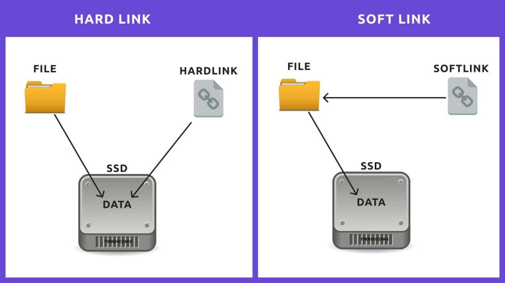

```{r setup, include=FALSE}
knitr::opts_chunk$set(echo = FALSE)
```

## Files

What is a file? How do you find it?

- The content of a file is stored on your hard drive at a specific location. If you don't know its location, you can never find it. Your file system keeps track of all file location (and their size) in order to retrieve their content.
- Deleting a file simply consists in "forgetting" its location (vs "formatting", where you really erase the content)

- File addresses are stored by an inode (identified by an integer). The file you see on your computer basically stores the inode and is therefore a "pointer" to its physical location.

```bash
$ ls -i # prints the inodes of files in the current folder
```
***

## Different types of links

- A pointer to the physical location of a file is called a hard link. When no hard link exist for a file, it's considered deleted.
- A soft link is a pointer to a hard link. \
    $\Rightarrow$ deleting a soft link cannot cause a file to be deleted
    $\Rightarrow$ if you delete the target of the soft link, the soft link points to nothing (event though the file may still exist)

{width="250"}

## Copy vs Link (References)

Why use references:

- Copying the file takes more space (the whole file content is duplicated in your hard drive)
- If you modify one file, the other is left unchanges $\rightarrow$ can lead to incoherences
- It can also be away to avoid long paths in your code. You can just symlink your data directory in your working directory

Similar idea when comparing variable vs pointers in programming languages

## Other remarks

- Hard links are only valid within the same File System. Why?
- Symbolic links can span file systems as they are simply the name of another file.
- 99.99..% of the time, I use symbolic links (easier to manage, less risks, better portability)
- What about folders/directories? Well, in unix systems, directories are actually considered as files (with the particularity that it contains other files)

Useful Stack Overflow post:

- https://unix.stackexchange.com/questions/346425/what-is-the-difference-between-a-hard-link-and-a-file

## Creating links

### Bash
```bash
$ ln source [target] # hard link
$ ln -s source [target] # symbolic link
```

### R
```R
> file.link(source, target)
> file.symlink(source, target)
```

## A few examples

Let's experiment with links:

- Identify links (and source)
- Looking at file size
- Deleting links: different behavior between symbolic and hard links
- Typical errors you can encounter (+ non-existent file vs link pointing to nothing)

## Exercises

Goal: create a new folder containing a subset of the files from a bigger project based on associated metadata

### Examples: 

- All the samples from the Ikewai project. 
- All the samples collected in wells


